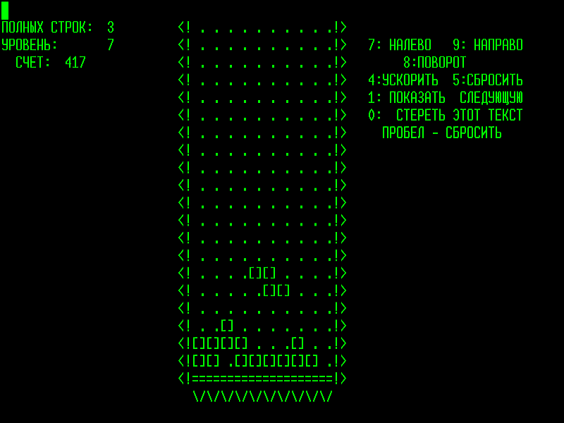

I recreated a Python implementation of the first version of Tetris created by Alekseï Pajitnov on the Elektronika 60 with the Curse library ! 

# Original Game

The first version only used ASCII characters and was played in a terminal.

# My Python Implementation

For my implementation, I use a matrix (a list of lists) to represent the game grid, and the pieces are also matrices.
