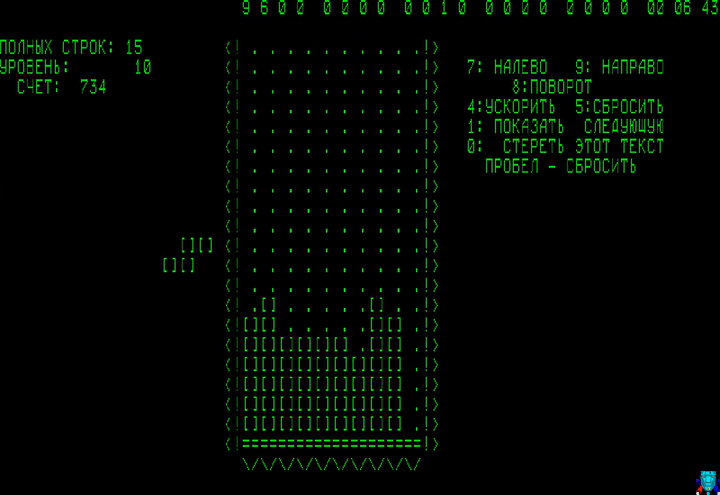
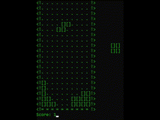

# Tetris Elektronika 60 — Python Recreation 🌀

> *A faithful Python reimagining of the **original 1984 Tetris** by Aleksei Pajitnov, as it ran on the Soviet **Elektronika 60** computer — now playable in your terminal!*

---

## 🖥️ About the Original
The very first version of Tetris:
- Ran on the **Elektronika 60**, a Soviet-era computer.
- Had **no graphics** — just **ASCII characters** in a terminal.
- Was controlled with simple keys — no mouse, no sound, no frills.
- Pure and minimalist

---

## 🐍 My Python Implementation

I rebuilt the experience using:
- **`curses` library** — for terminal-based rendering and real-time input.
- **Grid as a matrix** — the playfield is a list of lists (`[[...], [...], ...]`).
- **Pieces as matrices** — each tetromino is also represented by a 2D grid.
- Terminal-only, no GUI — just like 1984.

---

## 🕹️ Controls
- **← →** : Move piece left/right
- **↓** : Soft drop (accelerate fall)
- **↑** or **Space** : Rotate piece

---

